We gaan met 2D game framework Löve2D een spel met vallende blokken maken.

<!--more-->

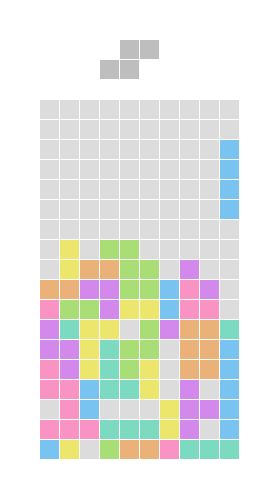

## De regels


Er zijn 7 verschillende stukken. Elk stuk bestaat uit 4 kleinere blokken.

Stukken vallen vanaf boven het speelveld. De speler kan het stuk verplaatsen naar links en rechts en het stuk
ronddraaien. Als een stuk is geland, valt er een volgend stuk.

Boven het speelveld wordt de vorm van het volgende stuk dat gaat vallen getoond.

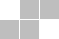

Als er een volledig gesloten rij van blokken is gevormd van links naar rechts op het speelveld, verdwijnt het
en schuiven alle blokken erboven 1 rij naar beneden.

Het spel eindigt als een nieuw stuk direct op een al liggend stuk terecht zou komen.

### Controls

| **toets**   | **actie**               |
|-------------|-------------------------|
| pijl links  | beweeg links            |
| pijl rechts | beweeg rechts           |
| z           | draai tegen de klok in  |
| x           | draai met de klok mee   |
| c           | val op liggende blokken |

## Overzicht

Een rooster bevat de blokken die al zijn gevallen. Een vak in het rooster kan leeg zijn of gevuld met een
blok van een bepaalde kleur.

Tekst `' '` (spatie) is een leeg vak zonder blok en `'i'`, `'j'`, `'l'`, `'o'`, `'s'`, `'t'` en `'z'` zijn vakken met
een blok met verschillende kleuren.

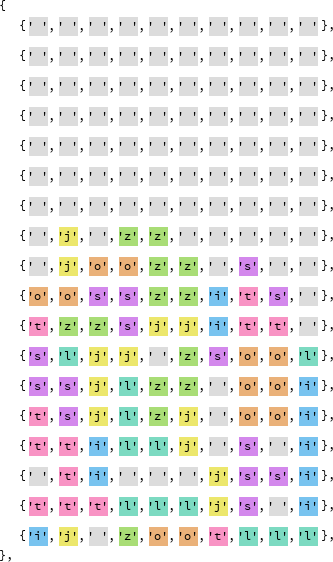

Alle verschillende stukken worden in het rooster opgeslagen met de hoe ze gedraaid waren toen ze vielen.

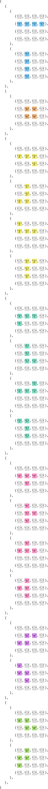

Een vallend stuk wordt opgeslagen met een getal dat aangeeft welk type stuk het is, hoe het gedraaid is
en wat de positie is in het rooster. Voor de positie worden X en Y waarden gebruikt.

Een nieuw stuk wordt boven het rooster getoond, maar niet als er te weinig voor is door al gestapelde blokken. In dat geval is 
het spel afgelopen.

De speler kan de stukken verplaatsen naar links en rechts, maar niet als het een stuk dat al gestapeld is overlapt. Een
stuk kan ook niet buiten het rooster verplaatst worden.

Als er wat tijd is verlopen, verplaatst het stuk één rij blokken naar beneden. Dit gebeurt alleen als de nieuwe positie
van het stuk niet overlapt met al gestapelde blokken en niet buiten het rooster valt.

Als knop `z` of `x` wordt ingedrukt, draait het stuk tegen de klok in of met de klok mee. Maar niet als het stuk dan
overlapt met al gestapelde blokken of buiten het rooster valt.

Als de val knop `c` wordt ingedrukt, gaat het stuk sneller naar beneden, totdat het landt op al geplaatste stukken. 

Als het stuk is geland, wordt een nieuw stuk gemaakt boven het rooster.

De 7 verschillende stukken worden in een willekeurige volgorde aangeboden.

## Programmeren

Voor het programmeren zelf heb je alleen een editor zoals bijvoorbeeld Visual Studio Code nodig. Maar om het programma
uit te voeren, heb je het Löve2D programma nodig. Deze kun je downloaden vanaf de site 
[https://love2d.org/](https://love2d.org/).

Als je Löve2D hebt geïnstalleerd, open je een terminal of cmd op Windows en zou je `love.exe` moeten kunnen starten.

Bij het starten van het script is het belangrijk om te onthouden dat je de directory meegeeft aan Love en niet `main.lua`.  
Dus:
```bash
love.exe blocks/
```
Hierbij bevat `blocks` het bestand `main.lua` waarin we de code schrijven van de volgende hoofdstukken.

### Het venster tekenen

We beginnen in een lege `conf.lua` met:

```lua
function love.conf(t)
    t.window.width = 20 * 14
    t.window.height = 20 * 25
end
```
<sup>[conf.lua](blocks_wip/conf.lua)</sup>

en een lege `main.lua`.

Als je nu `love.exe blocks/` uitvoert, krijg je een leeg rechthoekig scherm.

### Het rooster tekenen

Voor ieder blok in het speelveld wordt een vierkant getekend. 

Zet de volgende code in `main.lua`:
```lua
function love.draw()
    for y = 1, 18 do
        for x = 1, 10 do
            local blockSize = 20
            local blockDrawSize = blockSize - 1
            love.graphics.rectangle(
                'fill',
                (x - 1) * blockSize,
                (y - 1) * blockSize,
                blockDrawSize,
                blockDrawSize
            )
        end
    end
end
```
<sup>[main.lua](blocks_wip/main.lua_1)</sup>
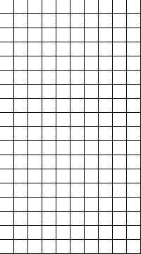

### Het rooster inkleuren

De achtergrondkleur en de kleur van een leeg vak worden ingesteld.

Voeg functie `love.load()` toe aan `main.lua`, boven functie `love.draw()` die er al in staat:

```lua
function love.load()
    love.graphics.setBackgroundColor(255, 255, 255)
end
```
<sup>[main.lua](blocks_wip/main.lua_2)</sup>

Pas nu functie `love.draw()` aan:
```lua

function love.draw()
    for y = 1, 18 do
        for x = 1, 10 do
            -- voeg toe:
            love.graphics.setColor(.87, .87, .87)
            --
            
            local blockSize = 20
            local blockDrawSize = blockSize - 1
            love.graphics.rectangle(
                'fill',
                (x - 1) * blockSize,
                (y - 1) * blockSize,
                blockDrawSize,
                blockDrawSize
            )
        end
    end
end
```
<sup>[main.lua](blocks_wip/main.lua_3)</sup>
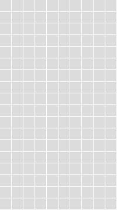

### De gevallen blokken bewaren

Het rooster voor de gevallen blokken is gemaakt en elk blok wordt als `' '` (spatie) gezet wat betekend 
dat het vak leeg is.

We gaan de breedte en hoogte van het rooster gebruiken om de blokken te tekenen, dus we zetten de waarden 10 en 18 in 
variabelen.

Pas de functies aan met:

```lua
function love.load()
    love.graphics.setBackgroundColor(255, 255, 255)

    -- voeg onderstaande toe:
    gridXCount = 10
    gridYCount = 18

    inert = {}
    for y = 1, gridYCount do
        inert[y] = {}
        for x = 1, gridXCount do
            inert[y][x] = ' '
        end
    end
    --
end

function love.draw()
    -- vervang:
    for y = 1, 18 do
        for x = 1, 10 do

    -- door:
    for y = 1, gridYCount do
        for x = 1, gridXCount do
    --
end
```
<sup>[main.lua](blocks_wip/main.lua_4)</sup>

### De kleur van de blokken

De kleur van de blokken die we gaan tekenen wordt bepaald door het type. 

Om dit testen, zetten we verschillende typen blokken in het rooster.  
De types geven we aan met een letter: `i`, `j`, `l`, `o`.. etc. Vervolgens koppelen we een kleur aan elk type.  
Bijvoorbeeld:

```lua
i = {.47, .76, .94},
```

Maak de volgende aanpassingen:

```lua
function love.load()
    -- voeg toe:
    inert[18][1] = 'i'
    inert[17][2] = 'j'
    inert[16][3] = 'l'
    inert[15][4] = 'o'
    inert[14][5] = 's'
    inert[13][6] = 't'
    inert[12][7] = 'z'
    --
end

function love.draw()
    for y = 1, gridYCount do
        for x = 1, gridXCount do
            -- vervang:
            love.graphics.setColor(.87, .87, .87)
            -- door dit:
            local colors = {
                [' '] = {.87, .87, .87},
                i = {.47, .76, .94},
                j = {.93, .91, .42},
                l = {.49, .85, .76},
                o = {.92, .69, .47},
                s = {.83, .54, .93},
                t = {.97, .58, .77},
                z = {.66, .83, .46},
            }
            local block = inert[y][x]
            local color = colors[block]
            love.graphics.setColor(color)
            -- tot hier toe.

            local blockSize = 20
            local blockDrawSize = blockSize - 1
            love.graphics.rectangle(
                'fill',
                (x - 1) * blockSize,
                (y - 1) * blockSize,
                blockDrawSize,
                blockDrawSize
            )
            --
        end
    end
end
```
<sup>[main.lua](blocks_wip/main.lua_5)</sup>
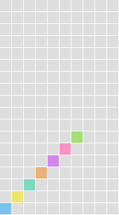

### De stukken opslaan

Een puzzelstuk bestaat uit verschillende blokken. We slaan de variaties van puzzelstuk op als een nieuw raster. 
In dit raster kunnen we ook de gedraaide versies van het puzzelstuk bewaren.

```lua
{
    {' ', ' ', ' ', ' '},
    {'i', 'i', 'i', 'i'},
    {' ', ' ', ' ', ' '},
    {' ', ' ', ' ', ' '},
}
```
Elk puzzelstuk kan 4 varianten hebben, want hij kan 4 kanten op gedraaid zijn.
We slaan dus 4 varianten op voor elk puzzelstuk. In het geval van de rechte lijn zijn dit er eigenlijk maar 2. 
Deze vorm is namelijk symmetrisch over 1 as.
De kubus heeft maar 1 variant. Deze is namelijk symmetrisch over 2 assen.
De rechte lijn ziet er als volgt uit:

```lua
{
    {
        {' ', ' ', ' ', ' '},
        {'i', 'i', 'i', 'i'},
        {' ', ' ', ' ', ' '},
        {' ', ' ', ' ', ' '},
    },
    {
        {' ', 'i', ' ', ' '},
        {' ', 'i', ' ', ' '},
        {' ', 'i', ' ', ' '},
        {' ', 'i', ' ', ' '},
    },
}
```

Dit zijn alle puzzelstukken; voeg deze toe aan functie `love.load()`:

```lua
function love.load()
    love.graphics.setBackgroundColor(255, 255, 255)
    pieceStructures = {
        {
            {
                {' ', ' ', ' ', ' '},
                {'i', 'i', 'i', 'i'},
                {' ', ' ', ' ', ' '},
                {' ', ' ', ' ', ' '},
            },
            {
                {' ', 'i', ' ', ' '},
                {' ', 'i', ' ', ' '},
                {' ', 'i', ' ', ' '},
                {' ', 'i', ' ', ' '},
            },
        },
        {
            {
                {' ', ' ', ' ', ' '},
                {' ', 'o', 'o', ' '},
                {' ', 'o', 'o', ' '},
                {' ', ' ', ' ', ' '},
            },
        },
        {
            {
                {' ', ' ', ' ', ' '},
                {'j', 'j', 'j', ' '},
                {' ', ' ', 'j', ' '},
                {' ', ' ', ' ', ' '},
            },
            {
                {' ', 'j', ' ', ' '},
                {' ', 'j', ' ', ' '},
                {'j', 'j', ' ', ' '},
                {' ', ' ', ' ', ' '},
            },
            {
                {'j', ' ', ' ', ' '},
                {'j', 'j', 'j', ' '},
                {' ', ' ', ' ', ' '},
                {' ', ' ', ' ', ' '},
            },
            {
                {' ', 'j', 'j', ' '},
                {' ', 'j', ' ', ' '},
                {' ', 'j', ' ', ' '},
                {' ', ' ', ' ', ' '},
            },
        },
        {
            {
                {' ', ' ', ' ', ' '},
                {'l', 'l', 'l', ' '},
                {'l', ' ', ' ', ' '},
                {' ', ' ', ' ', ' '},
            },
            {
                {' ', 'l', ' ', ' '},
                {' ', 'l', ' ', ' '},
                {' ', 'l', 'l', ' '},
                {' ', ' ', ' ', ' '},
            },
            {
                {' ', ' ', 'l', ' '},
                {'l', 'l', 'l', ' '},
                {' ', ' ', ' ', ' '},
                {' ', ' ', ' ', ' '},
            },
            {
                {'l', 'l', ' ', ' '},
                {' ', 'l', ' ', ' '},
                {' ', 'l', ' ', ' '},
                {' ', ' ', ' ', ' '},
            },
        },
        {
            {
                {' ', ' ', ' ', ' '},
                {'t', 't', 't', ' '},
                {' ', 't', ' ', ' '},
                {' ', ' ', ' ', ' '},
            },
            {
                {' ', 't', ' ', ' '},
                {' ', 't', 't', ' '},
                {' ', 't', ' ', ' '},
                {' ', ' ', ' ', ' '},
            },
            {
                {' ', 't', ' ', ' '},
                {'t', 't', 't', ' '},
                {' ', ' ', ' ', ' '},
                {' ', ' ', ' ', ' '},
            },
            {
                {' ', 't', ' ', ' '},
                {'t', 't', ' ', ' '},
                {' ', 't', ' ', ' '},
                {' ', ' ', ' ', ' '},
            },
        },
        {
            {
                {' ', ' ', ' ', ' '},
                {' ', 's', 's', ' '},
                {'s', 's', ' ', ' '},
                {' ', ' ', ' ', ' '},
            },
            {
                {'s', ' ', ' ', ' '},
                {'s', 's', ' ', ' '},
                {' ', 's', ' ', ' '},
                {' ', ' ', ' ', ' '},
            },
        },
        {
            {
                {' ', ' ', ' ', ' '},
                {'z', 'z', ' ', ' '},
                {' ', 'z', 'z', ' '},
                {' ', ' ', ' ', ' '},
            },
            {
                {' ', 'z', ' ', ' '},
                {'z', 'z', ' ', ' '},
                {'z', ' ', ' ', ' '},
                {' ', ' ', ' ', ' '},
            },
        },
    }
```
<sup>[main.lua](blocks_wip/main.lua_6)</sup>

### Het vallende stuk opslaan
Er kan altijd maar een puzzelstuk tegelijkertijd vallen. We kunnen dit puzzelstuk opslaan met de variabelen `pieceType`
en `pieceRotation`. `pieceType` bevat welk stuk het is (lijn, blokje, etc). `pieceRotation` bevat hoe het stuk gedraaid is.

```lua
function love.load()
    -- voeg toe aan het einde van de functie:
    pieceType = 1
    pieceRotation = 1
    --
end
```
<sup>[main.lua](blocks_wip/main.lua_7)</sup>

### Het stuk tekenen
Elk puzzelstuk wordt getekend door langs elk vakje in het rooster te gaan en de blokken een voor een in te kleuren.  
De kleur is afhankelijk van het type blok.  

```lua
function love.draw()

    -- voeg dit hele stuk code toe onderaan deze functie
    for y = 1, 4 do
        for x = 1, 4 do
            local block = pieceStructures[pieceType][pieceRotation][y][x]
            if block ~= ' ' then
                local colors = {
                    i = {.47, .76, .94},
                    j = {.93, .91, .42},
                    l = {.49, .85, .76},
                    o = {.92, .69, .47},
                    s = {.83, .54, .93},
                    t = {.97, .58, .77},
                    z = {.66, .83, .46},
                }
                local color = colors[block]
                love.graphics.setColor(color)

                local blockSize = 20
                local blockDrawSize = blockSize - 1
                love.graphics.rectangle(
                    'fill',
                    (x - 1) * blockSize,
                    (y - 1) * blockSize,
                    blockDrawSize,
                    blockDrawSize
                )
            end
        end
    end
    --
end
```
<sup>[main.lua](blocks_wip/main.lua_8)</sup>

En verwijder dit stuk uit functie `love.load()`:
```lua
    inert[18][1] = 'i'
    inert[17][2] = 'j'
    inert[16][3] = 'l'
    inert[15][4] = 'o'
    inert[14][5] = 's'
    inert[13][6] = 't'
    inert[12][7] = 'z'
```
<sup>[main.lua](blocks_wip/main.lua_9)</sup>

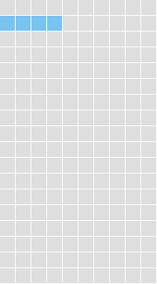

### De code vereenvoudigen
De code voor het tekenen van een stilstaand blok lijkt erg op de code voor het tekenen van een vallend blok.
We voegen daarom de functie `drawBlock` toe en verplaatsen de code in de twee for-loops er naartoe.

Vervang alle code in `love.draw()` met deze code:
```lua
function love.draw()
    local function drawBlock(block, x, y)
        local colors = {
            [' '] = {.87, .87, .87},
            i = {.47, .76, .94},
            j = {.93, .91, .42},
            l = {.49, .85, .76},
            o = {.92, .69, .47},
            s = {.83, .54, .93},
            t = {.97, .58, .77},
            z = {.66, .83, .46},
        }
        local color = colors[block]
        love.graphics.setColor(color)

        local blockSize = 20
        local blockDrawSize = blockSize - 1
        love.graphics.rectangle(
            'fill',
            (x - 1) * blockSize,
            (y - 1) * blockSize,
            blockDrawSize,
            blockDrawSize
        )
    end

    for y = 1, gridYCount do
        for x = 1, gridXCount do
            drawBlock(inert[y][x], x, y)
        end
    end

    for y = 1, 4 do
        for x = 1, 4 do
            local block = pieceStructures[pieceType][pieceRotation][y][x]
            if block ~= ' ' then
                drawBlock(block, x, y)
            end
        end
    end
end
```
<sup>[main.lua](blocks_wip/main.lua_10)</sup>

### Het stuk draaien
Wanneer we op de x-toets drukken willen wat dat het stuk draait. 

`pieceRotation` bevat een getal dat de draaiing aangeeft. 1 is geen draaiing, 2 is 90&deg; met de klok mee en 3 is 180&deg;. 

Als het rotation getal hoger is dan de verschillende draai posities (4, 2 of 1). Dan wordt het getal terug gezet naar 1.

Als we op z-toets drukken willen we dat het het stuk de andere kant op draait. Dit doen we door de waarde in
`pieceRotation` met 1 te verlagen.

Als het getal lager wordt dan 0. Zetten we het weer terug naar 1.

Voeg dit stuk code toe onderaan het bestand:

```lua
function love.keypressed(key)
    if key == 'x' then
        pieceRotation = pieceRotation + 1
        if pieceRotation > #pieceStructures[pieceType] then
            pieceRotation = 1
        end

    elseif key == 'z' then
        pieceRotation = pieceRotation - 1
        if pieceRotation < 1 then
            pieceRotation = #pieceStructures[pieceType]
        end
    end
end
```
<sup>[main.lua](blocks_wip/main.lua_11)</sup>

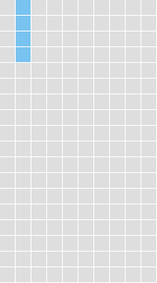

### De stukken testen

We willen graag de code testen. Daarom voegen we toe dat we het puzzelstuk kunnen veranderen met de omhoog en omlaag pijltjestoetsen.   
De tijdelijke code onderaan functie `love.keypressed(key)`:

```lua
function love.keypressed(key)
    -- vervang laatste twee "end" regels met onderstaande tijdelijke code:
    elseif key == 'down' then
        pieceType = pieceType + 1
        if pieceType > #pieceStructures then
            pieceType = 1
        end
        pieceRotation = 1
    elseif key == 'up' then
        pieceType = pieceType - 1
        if pieceType < 1 then
            pieceType = #pieceStructures
        end
        pieceRotation = 1
    end
    --
end
```
<sup>[main.lua](blocks_wip/main.lua_12)</sup>

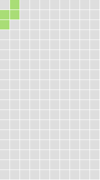
Als je hebt gezien dat de stukken veranderen, kun je de net toegevoegde code weer verwijderen.

### De positie van het vallende stuk bijhouden

We bewaren de positie van het vallende puzzelstuk op in het rooster en we tekenen het puzzelstuk op die positie.

```lua
function love.load()
    -- voeg deze regels toe onderaan deze functie
    pieceX = 3
    pieceY = 0
    --
end
```

En het tekenen van het blok op de juiste positie:
```lua
function love.draw()
    -- vervang:
                drawBlock(block, x, y)
                
    -- met:
                drawBlock(block, x + pieceX, y + pieceY)
    --
end
```
<sup>[main.lua](blocks_wip/main.lua_13)</sup>

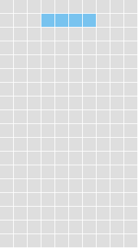

### Het stuk verplaatsen

We gaan nu de linker en rechter pijltjestoetsen gebruiken om het stuk te verplaatsen. 

Voeg de volgende regels toe onderaan `love.keypressed(key)`:

```lua
function love.keypressed(key)
    -- vervang de een na laatste "end" met: 
    elseif key == 'left' then
        pieceX = pieceX - 1

    elseif key == 'right' then
        pieceX = pieceX + 1
    end
    --
end
```
<sup>[main.lua](blocks_wip/main.lua_14)</sup>

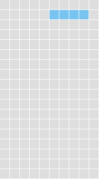

### Timer
We willen dat elke 0.5 seconden het puzzelstuk valt.

We maken daarom een `timer` variabele, die we steeds met `dt` (delta time: de tijd die verstreken is) verhogen.

Als de waarde van `timer` gelijk aan 0.5 of hoger is, zetten we het terug naar 0.  

```lua
function love.load()
    -- onderaan deze functie:
    timer = 0
    --
end
```
En een nieuwe functie onderaan het bestand:
```lua
function love.update(dt)
    timer = timer + dt
    if timer >= 0.5 then
        timer = 0
        -- tijdelijk; kijk naar de console/cmd window voor een tick elke halve seconde
        print('tick')
        --
    end
end
```
<sup>[main.lua](blocks_wip/main.lua_15)</sup>  
Na het testen mag je `print('tick')` weer weghalen.

### Stukken vallen

We gebruiken de timer om het stuk elke 0.5 seconden verder naar beneden te laten vallen.   
De waarde van `pieceY` wordt met 1 verhoogd om het stuk 1 regel lager te tekenen:

```lua
function love.update(dt)
    timer = timer + dt
    if timer >= 0.5 then
        timer = 0
        -- voeg toe:
        pieceY = pieceY + 1
        --
    end
end
```
<sup>[main.lua](blocks_wip/main.lua_16)</sup>  

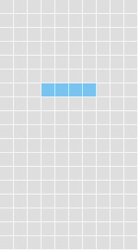

### Confining movement
We willen voorkomen dat de puzzelstukken links of rechts van het scherm af kunnen bewegen. Daarom checken we altijd eerst of alle blokken nog wel in het speelveld zijn.

We wilen deze check vaker uitvoeren, daarom stoppen we het in een functie. Dan kunnen we het makkelijk herbruiken. De functie heeft de positie en rotatie nodig. De functie geeft true of false terug om aan te geven of we mogen bewegen of draaien.

We noemen de functie: canpieceMove(testX, testY, testRotation). Voor nu zal de functie alleen true returnen, dan kunnen we namelijk de functie in de rest van de code verwerken.

We passen de code aan zodat de check functie eerst wordt uitgevoerd voordat we bewegen of draaien.

De volledige code tot op dit punt:

```lua
function love.load()
    -- voeg aan het einde van de functie toe:
    function canPieceMove(testX, testY, testRotation)
        return true
    end
    --
end

function love.update(dt)
    timer = timer + dt
    if timer >= 0.5 then
        timer = 0

        -- vervang:
        pieceY = pieceY + 1
        
        -- door:
        local testY = pieceY + 1
        if canPieceMove(pieceX, testY, pieceRotation) then
            pieceY = testY
        end
        --
    end
end

function love.keypressed(key)
    elseif key == 'left' then
        -- vervang:
        pieceX = pieceX - 1
        
        -- door:
        local testX = pieceX - 1

        if canPieceMove(testX, pieceY, pieceRotation) then
            pieceX = testX
        end
        --
    elseif key == 'right' then
        -- vervang:
        pieceX = pieceX + 1

        -- door:        
        local testX = pieceX + 1

        if canPieceMove(testX, pieceY, pieceRotation) then
            pieceX = testX
        end
        --
    end
end
``` 
<sup>[main.lua](blocks_wip/main.lua_17)</sup>  

### Checking left of playing area
We beginnen met links checken. Als het blok niet leeg is, en de x positie lager is dan 1, geeft de functie false terug. 

De volledige code tot op dit punt:

```lua
function love.load()
    -- vervang functie canPieceMove in zijn geheel door:
    function canPieceMove(testX, testY, testRotation)
        for y = 1, 4 do
            for x = 1, 4 do
                if pieceStructures[pieceType][testRotation][y][x] ~= ' '
                        and (testX + x) < 1 then
                    return false
                end
            end
        end

        return true
    end
    --
end
```
<sup>[main.lua](blocks_wip/main.lua_18)</sup>  

### Simplifying code
Het aantal blokken van elk puzzelstuk op de X en Y worden herbruikt uit het tekenen. We stoppen deze waardes in variabelen.

De volledige code tot op dit punt:

```lua
function love.load()
    -- vervang functie canPieceMove weer, maar nu in zijn geheel door:
    pieceXCount = 4
    pieceYCount = 4

    function canPieceMove(testX, testY, testRotation)
        for y = 1, pieceYCount do
            for x = 1, pieceXCount do
                if pieceStructures[pieceType][testRotation][y][x] ~= ' '
                        and (testX + x) < 1 then
                    return false
                end
            end
        end

        return true
    end
    --
end

function love.draw()
    -- vervang:
    for y = 1, 4 do
        for x = 1, 4 do
    -- met:    
    for y = 1, pieceYCount do
        for x = 1, pieceXCount do
    --
            local block = pieceStructures[pieceType][pieceRotation][y][x]
            if block ~= ' ' then
                drawBlock(block, x + pieceX, y + pieceY)
            end
        end
    end
end
```
<sup>[main.lua](blocks_wip/main.lua_19)</sup>  

### Checking right of playing area 
We gaan nu rechts checken. Als het blok niet leeg is, en de x positie groter is dan het grid, geeft de functie false terug. 

De volledige code tot op dit punt:

```lua
function love.load()

    function canPieceMove(testX, testY, testRotation)
        for y = 1, pieceYCount do
            for x = 1, pieceXCount do
                -- replace
                if pieceStructures[pieceType][testRotation][y][x] ~= ' '
                        and (testX + x) < 1 then
                    return false
                end
                -- by:
                if pieceStructures[pieceType][testRotation][y][x] ~= ' ' and 
                    ((testX + x) < 1 or (testX + x) > gridXCount)
                then
                    return false
                end
                --
            end
        end

        return true
    end
end
```
<sup>[main.lua](blocks_wip/main.lua_20)</sup>  

### Checking bottom of playing area
Het puzzelstuk moet stoppen als het de onderkant aanraak. Als de onderkant van het puzzelstuk lager is dan de onderkant van het veld geeft de functie false terug. 

De volledige code tot op dit punt:

```lua
function love.load()

    function canPieceMove(testX, testY, testRotation)
        for y = 1, pieceYCount do
            for x = 1, pieceXCount do
                -- replace:
                if pieceStructures[pieceType][testRotation][y][x] ~= ' ' and 
                    ((testX + x) < 1 or (testX + x) > gridXCount)
                then
                    return false
                end
                -- by:
                if pieceStructures[pieceType][testRotation][y][x] ~= ' ' and 
                    (
                        (testX + x) < 1
                        or (testX + x) > gridXCount
                        or (testY + y) > gridYCount
                    ) 
                then
                    return false
                end
                --
            end
        end

        return true
    end
end
```
<sup>[main.lua](blocks_wip/main.lua_21)</sup>  

### Checking inert 
Als er al een ander puzzelstuk is, kan het puzzelstuk daar niet naartoe bewegen. Daarom checken we of er al een blok is op die plek. Als dat zo is geeft de functie ook false terug.

We testen dit door zelf een blokje op het speeldveld te zetten.

De volledige code tot op dit punt:

```lua
function love.load()

    function canPieceMove(testX, testY, testRotation)
        for y = 1, pieceYCount do
            for x = 1, pieceXCount do
                if pieceStructures[pieceType][testRotation][y][x] ~= ' ' and
                    -- replace: 
                    (
                        (testX + x) < 1
                        or (testX + x) > gridXCount
                        or (testY + y) > gridYCount
                    ) 
                    -- by:
                    (
                        (testX + x) < 1
                        or (testX + x) > gridXCount
                        or (testY + y) > gridYCount
                        or inert[testY + y][testX + x] ~= ' '
                    )
                    -- 
                then
                    return false
                end
            end
        end

        return true
    end

    -- tijdelijk, om toegevoegde voorwaarde te testen
    inert[8][5] = 'z'
    --
end
```
<sup>[main.lua](blocks_wip/main.lua_22)</sup>  

Als het stuk valt, wordt het geblokkeerd door het blok. Schuif het stuk eens naar links of rechts. Wat gebeurt er?

Verwijder na het testen de tijdelijke code.

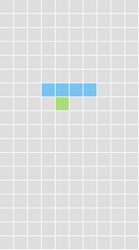

#### Simplifying code
De blok posities die we testen kunnen we herbruiken. We stoppen deze in variabelen.

De volledige code tot op dit punt:

```lua
function love.load()

    function canPieceMove(testX, testY, testRotation)
        for y = 1, pieceYCount do
            for x = 1, pieceXCount do
                -- vervang:
                if pieceStructures[pieceType][testRotation][y][x] ~= ' ' and
                    (
                        (testX + x) < 1
                        or (testX + x) > gridXCount
                        or (testY + y) > gridYCount
                        or inert[testY + y][testX + x] ~= ' '
                    )
                then
                    return false
                end
                -- door:                
                local testBlockX = testX + x
                local testBlockY = testY + y

                if pieceStructures[pieceType][testRotation][y][x] ~= ' ' and 
                    (
                        testBlockX < 1
                        or testBlockX > gridXCount
                        or testBlockY > gridYCount
                        or inert[testBlockY][testBlockX] ~= ' '
                    )
                then
                    return false
                end
                --
            end
        end

        return true
    end
end
```
<sup>[main.lua](blocks_wip/main.lua_23)</sup>  

### Drop 
Als de speler c indrukt laten we het puzzelstuk snel vallen. Zolang c is ingedrukt verhogen we de Y positie met 1 totdat het puzzelstuk iets raakt.

De volledige code tot op dit punt:

```lua
function love.keypressed(key)
    -- voeg
    elseif key == 'c' then
        while canPieceMove(pieceX, pieceY + 1, pieceRotation) do
            pieceY = pieceY + 1
        end
    -- toe voor de één na laatste "end"
    end
end
```
<sup>[main.lua](blocks_wip/main.lua_24)</sup>  

### Resetting piece
Als de timer tikt, en het puzzelstuk niet verder kan bewegen, resetten we de positie en rotatie en type.

De volledige code tot op dit punt:

```lua
function love.update(dt)
    timer = timer + dt
    if timer >= 0.5 then
        timer = 0
        local testY = pieceY + 1
        -- vervang:
        if canPieceMove(pieceX, testY, pieceRotation) then
            pieceY = testY
        end
        -- door:
        if canPieceMove(pieceX, testY, pieceRotation) then
            pieceY = testY
        else
            pieceX = 3
            pieceY = 0
            pieceType = 1
            pieceRotation = 1
        end
        --
    end
end
``` 
<sup>[main.lua](blocks_wip/main.lua_25)</sup>  

### Simplifying code 
We resetten het puzzelstuk vaker, dus we stoppen de code in een functie om her te gebruiken.

De volledige code tot op dit punt:

```lua
function love.load()
    -- voeg toe aan einde van functie 
    function newPiece()
        pieceX = 3
        pieceY = 0
        pieceType = 1
        pieceRotation = 1
    end

    newPiece()
    -- 
end

function love.update(dt)
    timer = timer + dt
    if timer >= 0.5 then
        timer = 0

        local testY = pieceY + 1
        if canPieceMove(pieceX, testY, pieceRotation) then
            pieceY = testY
        else
        -- vervang:
            pieceX = 3
            pieceY = 0
            pieceType = 1
            pieceRotation = 1
        -- door:
            newPiece()
        --
        end
    end
end
```
<sup>[main.lua](blocks_wip/main.lua_26)</sup>  

### Creating the sequence of next pieces
We maken nu een sequence (volgorde) waarin de puzzelstukken gaan vallen. We slaan deze op als een tabel met getallen die aangeven welk puzzelstuk het is. 

We stoppen alle verschillende nummers/puzzelstuk types in de tabel op een willekeurige positie. 

We testen dit door een sequence te maken en te printen als je op s drukt

De volledige code tot op dit punt:

```lua
function love.load()
    -- voeg toe aan einde van functie 

    function newSequence()
        sequence = {}
        for pieceTypeIndex = 1, #pieceStructures do
            local position = love.math.random(#sequence + 1)
            table.insert(
                sequence,
                position,
                pieceTypeIndex
            )
        end
    end
    newSequence()
    --
end

function love.keypressed(key)
    -- tijdelijke code
    elseif key == 's' then
        newSequence()
        print(table.concat(sequence, ', '))
    --
    end
end
```
<sup>[main.lua](blocks_wip/main.lua_27)</sup>  

Resultaat van drukken op knop "s" in tijdelijke code:

`3, 2, 4, 1, 7, 5, 6`

Verwijder de tijdelijke code na het testen.

### New piece from sequence 
Wanneer er een nieuw puzzelstuk wordt gemaakt, halen we de vorige uit de sequence en herbruiken we het. 

Als de sequence leeg, is maken we een nieuwe.

We verplaatsen de newPiece functie naar onder de newSequence functie.
De volledige code tot op dit punt:

```lua
function love.load()

    -- vervang:
    function newPiece()
        pieceX = 3
        pieceY = 0
        pieceType = 1
        pieceRotation = 1
    end
    -- door:
    function newPiece()
        pieceX = 3
        pieceY = 0
        pieceRotation = 1
        pieceType = table.remove(sequence)

        if #sequence == 0 then
            newSequence()
        end
    end
    --
    newPiece()
end
```
<sup>[main.lua](blocks_wip/main.lua_28)</sup>  

### Add to inert 
When a piece has come to rest, the piece's blocks are added to the inert blocks.

The piece's blocks are looped through, and if a block isn't empty, then the inert block at this position is set to the type of the piece's block.

De volledige code tot op dit punt:

```lua
function love.update(dt)
    timer = timer + dt
    if timer >= 0.5 then
        timer = 0

        local testY = pieceY + 1
        if canPieceMove(pieceX, testY, pieceRotation) then
            pieceY = testY
        else
            -- voeg toe
            for y = 1, pieceYCount do
                for x = 1, pieceXCount do
                    local block =
                        pieceStructures[pieceType][pieceRotation][y][x]
                    if block ~= ' ' then
                        inert[pieceY + y][pieceX + x] = block
                    end
                end
            end
            --
            newPiece()
        end
    end
end
```
<sup>[main.lua](blocks_wip/main.lua_29)</sup>  

### New piece immediately after drop 
When a piece is dropped, the timer is set immediately to the limit so that adding the piece to the inert pieces and creating the new piece happen immediately instead of waiting for the timer.

The timer limit is reused, so it is made into a variable.

De volledige code tot op dit punt:

```lua
function love.load()
    -- vervang:
    pieceY = 0
    timer = 0

    pieceXCount = 4
    -- door:    
    pieceY = 0
    timer = 0
    timerLimit = 0.5

    pieceXCount = 4
    -- 
end

function love.update(dt)
    -- vervang:
    timer = timer + dt
    if timer >= 0.5 then
    -- door:
    timer = timer + dt
    if timer >= timerLimit then
    -- 
end

function love.keypressed(key)
    elseif key == 'c' then
        -- vervang:
        while canPieceMove(pieceX, pieceY + 1, pieceRotation) do
            pieceY = pieceY + 1
        end
        -- door:        
        while canPieceMove(pieceX, pieceY + 1, pieceRotation) do
            pieceY = pieceY + 1
            timer = timerLimit
        end
        --
    end
end
```
<sup>[main.lua](blocks_wip/main.lua_30)</sup>  


### Finding complete rows 
Each row of the inert blocks is looped through, and if none of the columns of the row contain an empty block, then the row is complete.

For now, the complete row numbers are printed out.

De volledige code tot op dit punt:

```lua
function love.update(dt)
    timer = timer + dt
    if timer >= timerLimit then
        timer = 0

        local testY = pieceY + 1
        if canPieceMove(pieceX, testY, pieceRotation) then
            pieceY = testY
        else
            for y = 1, pieceYCount do
                for x = 1, pieceXCount do
                    local block =
                        pieceStructures[pieceType][pieceRotation][y][x]
                    if block ~= ' ' then
                        inert[pieceY + y][pieceX + x] = block
                    end
                end
            end
            -- voeg to:            
            for y = 1, gridYCount do
                local complete = true
                for x = 1, gridXCount do
                    if inert[y][x] == ' ' then
                        complete = false
                        break
                    end
                end
                
                -- tijdelijke code
                if complete then
                    print('Complete row: '..y)
                end
                --
            end
            --            
            newPiece()
        end
    end
end
```
<sup>[main.lua](blocks_wip/main.lua_31)</sup>  


### Removing complete rows
If the row is complete, the rows from the complete row to the row second from the top are looped through.

Each block in the row is looped through and set to the value of the block above it. Because there is nothing above the top row it doesn't need to be looped through.

The top row is then set to all empty blocks.

De volledige code tot op dit punt:

```lua
function love.update(dt)

            for y = 1, gridYCount do
                local complete = true
                for x = 1, gridXCount do
                    if inert[y][x] == ' ' then
                        complete = false
                        break
                    end
                end

                -- vervang:
                if complete then
                   -- tijdelijke code
                   print('Complete row: '..y)
                end
                -- door:
                if complete then
                    for removeY = y, 2, -1 do
                        for removeX = 1, gridXCount do
                            inert[removeY][removeX] =
                            inert[removeY - 1][removeX]
                        end
                    end

                    for removeX = 1, gridXCount do
                        inert[1][removeX] = ' '
                    end
                end
                --
            end
end
```
<sup>[main.lua](blocks_wip/main.lua_32)</sup>  

### Game over
If a newly created piece is in an unmovable position, then the game is over.

For now, love.load is called to reset the game to its initial state.

De volledige code tot op dit punt:

```lua
function love.update(dt)
            -- voeg toe aan het einde van deze functie
            if not canPieceMove(pieceX, pieceY, pieceRotation) then
                love.load()
            end
            --
        end
    end
end
```
<sup>[main.lua](blocks_wip/main.lua_33)</sup>  

### Offsetting the playing area
The playing area is drawn 2 blocks from the left of the screen and 5 blocks from the top of the screen.

De volledige code tot op dit punt:

```lua
function love.draw()
    -- vervang:
    for y = 1, gridYCount do
        for x = 1, gridXCount do
            drawBlock(inert[y][x], x, y)
        end
    end

    for y = 1, pieceYCount do
        for x = 1, pieceXCount do
            local block = pieceStructures[pieceType][pieceRotation][y][x]
            if block ~= ' ' then
                drawBlock(block, x + pieceX, y + pieceY)
            end
        end
    end
    -- door:    
    local offsetX = 2
    local offsetY = 5

    for y = 1, gridYCount do
        for x = 1, gridXCount do
            drawBlock(inert[y][x], x + offsetX, y + offsetY)
        end
    end

    for y = 1, pieceYCount do
        for x = 1, pieceXCount do
            local block = pieceStructures[pieceType][pieceRotation][y][x]
            if block ~= ' ' then
                drawBlock(block, x + pieceX + offsetX, y + pieceY + offsetY)
            end
        end
    end
    --
end
``` 
<sup>[main.lua](blocks_wip/main.lua_34)</sup>  

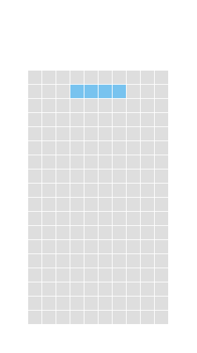

### Drawing the upcoming piece
The last piece of the sequence (i.e. the next piece to fall) is drawn at its first rotation position. It is offset 5 blocks from the left and 1 block from the top.

De volledige code tot op dit punt:

```lua
function love.draw()

    local function drawBlock(block, x, y)
        local colors = {
            [' '] = {.87, .87, .87},
            i = {.47, .76, .94},
            j = {.93, .91, .42},
            l = {.49, .85, .76},
            o = {.92, .69, .47},
            s = {.83, .54, .93},
            t = {.97, .58, .77},
            z = {.66, .83, .46},
            -- voeg toe:
            preview = {.75, .75, .75},
            --
        }
```

```lua
    -- voeg to aan het eind van de functie
    for y = 1, pieceYCount do
        for x = 1, pieceXCount do
            local block = pieceStructures[sequence[#sequence]][1][y][x]
            if block ~= ' ' then
                drawBlock('preview', x + 5, y + 1)
            end
        end
    end
    --
end
```
<sup>[main.lua](blocks_wip/main.lua_35)</sup>  

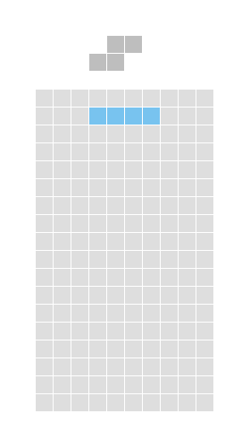

### Resetting the game
When the game is over, only some of the variables need to be reset, so a function is made.

De volledige code tot op dit punt:

```lua
function love.load()
    -- voeg toe aan het einde van de functie
    function reset()
        inert = {}
        for y = 1, gridYCount do
            inert[y] = {}
            for x = 1, gridXCount do
                inert[y][x] = ' '
            end
        end

        newSequence()
        newPiece()

        timer = 0
    end

    reset()
    --
end

function love.update(dt)
            -- vervang:
            if not canPieceMove(pieceX, pieceY, pieceRotation) then
                love.load()
            end
            -- met:
            if not canPieceMove(pieceX, pieceY, pieceRotation) then
                reset()
            end
            --
        end
    end
end
```
<sup>[main.lua](blocks_wip/main.lua_36)</sup>  

**Veel plezier met spelen!**
## Bron

Deze instructie is een vertaling van de Engelstalige tutorial
[Blocks: A tutorial for Lua and LÖVE 11](https://simplegametutorials.github.io/love/blocks/) van 
simple.game.tutorials@gmail.com.


